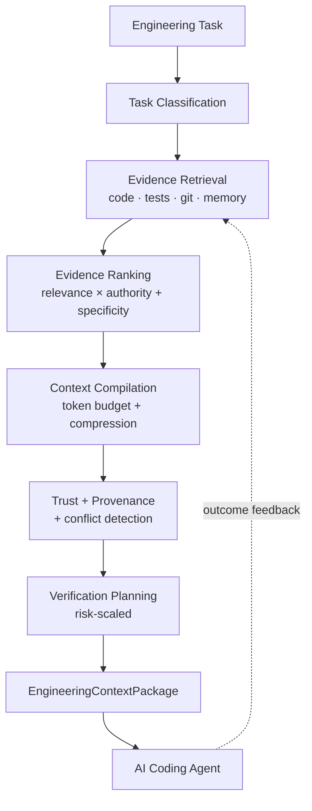

# Engineering Context Compiler (ECC)

**The context and evidence layer for AI-native software engineering.** ECC turns a messy
engineering task ("investigate an intermittent timeout in the payment service") into the
smallest, highest-value, evidence-backed context package an AI coding agent needs to act on
it — ranked, trust-labeled, token-budgeted, and honest about what it doesn't know.

[](https://github.com/ramesh-kumar-l/Engineering-Context-Compiler/actions/workflows/ci.yml)
[](LICENSE)


## Why this exists

Modern coding agents are good at reading code but bad at knowing *what matters*. Point one at
a real repository and it either reads too little (misses the file that actually caused the
bug) or too much (burns its context window loading files, tests, and history that have
nothing to do with the task). Neither failure is about model quality — it's a **retrieval and
judgment** problem: nobody told the agent which evidence is relevant, which source to trust,
what's already been tried, or how risky the change actually is.

ECC is a deterministic pipeline that answers that question *before* the agent starts working:
given a free-text task and a real repository, it retrieves code/test/git/decision evidence,
ranks it by relevance and source authority, compresses it to fit a token budget, attaches
provenance and a trust level to every item, and hands back a single validated JSON package —
plus a risk-scaled verification plan and a note about what it deliberately excluded and why.

## What it does

- Classifies a free-text task into one of nine types (`explain`, `debug`, `modify`, `review`,
  `refactor`, `investigate`, `plan`, `test`, `optimize`).
- Retrieves candidate evidence from source code (with resolved symbols), related tests, git
  history, and a persistent per-repository decision/incident/outcome memory.
- Ranks evidence on more than one signal (relevance × source authority + specificity), not
  relevance alone.
- Compresses ranked evidence into a token budget with an explicit, counted `excluded` reason
  for anything left out — never a silently truncated result.
- Attaches provenance and a `fact` / `derived` / `inference` / `unknown` trust level to every
  item, and surfaces (never silently resolves) conflicting evidence about the same subject.
- Recommends a verification plan scaled to task risk.
- Learns from outcomes: recording that a past change worked or didn't measurably shifts that
  path's ranking and memory relevance in future compilations.
- Ships the same pipeline behind five surfaces: CLI, MCP tool, VS Code command, GitHub PR
  comment, and an agent skill.

## What it does NOT do

- It is not a coding agent, IDE, or LLM — it doesn't write or execute code changes.
- It doesn't replace RAG/embeddings/code search — it's a layer *above* retrieval that adds
  ranking, trust, budgeting, and verification judgment (see the [FAQ](#faq)).
- It doesn't call any LLM itself. Every ranking/trust/risk decision is deterministic,
  rule-based, and inspectable — no model call, no hidden non-determinism.
- It doesn't send your source code anywhere. Everything runs locally against your own
  checkout; the only network call in the whole system is the GitHub integration posting a PR
  comment via the workflow's own token.

## How it works



One core pipeline, five thin surfaces (CLI / MCP / VS Code / GitHub / agent skill) that all
call the same `runContext()` — no duplicated logic per integration. See
[`project-memory-bank/02-architecture.md`](project-memory-bank/02-architecture.md) for the
full component breakdown and [`project-memory-bank/04-decisions.md`](project-memory-bank/04-decisions.md)
for why each piece is built the way it is.

## Golden examples

Two end-to-end walkthroughs with real captured output, real token counts, and reproduction
steps:

- [`docs/examples/golden-example-01-debugging/`](docs/examples/golden-example-01-debugging/) —
  investigating an intermittent failure: what a naive agent would load vs. what ECC selects
  and excludes, and why.
- [`docs/examples/golden-example-02-refactoring/`](docs/examples/golden-example-02-refactoring/) —
  scoping a refactor: affected components, historical decisions, risk-scaled verification.

## Blog series

Five standalone technical articles on the ideas behind ECC — what's implemented and measured
today vs. what's a stated future direction — under [`docs/blogs/`](docs/blogs/):

1. [Why AI Coding Agents Need Better Context, Not More Context](docs/blogs/01-context-not-more-context.md)
2. [Building an Engineering Context Compiler](docs/blogs/02-building-an-engineering-context-compiler.md)
3. [Why RAG Alone Is Not Enough for Software Engineering](docs/blogs/03-why-rag-alone-is-not-enough-for-software-engineering.md)
4. [Measuring AI Engineering Productivity: Tokens Are Only the Beginning](docs/blogs/04-measuring-ai-engineering-productivity.md)
5. [From Context Engineering to Engineering Intelligence](docs/blogs/05-from-context-engineering-to-engineering-intelligence.md)

## Quick start

Requires Node.js 20+. No API key, no Docker, no external service — everything below runs
against your own machine and your own repository.

```bash
git clone https://github.com/ramesh-kumar-l/Engineering-Context-Compiler.git
cd Engineering-Context-Compiler
npm ci
npm run build
```

Compile context for a real task against any repository (here, against ECC's own repo, with a
deliberately tight budget so you can see exclusion happen):

```bash
node dist/cli/index.js context "explain the memory retriever module" --path . --budget 800
```

Output (abridged — captured from this exact command):

```json
{
  "version": "0.1",
  "task": { "type": "explain", "request": "explain the memory retriever module" },
  "repository": { "name": "Engineering-Context-Compiler", "commit": "aec9925..." },
  "context": {
    "primary": [
      { "source": "code", "path": "src/core/memory/memoryRetriever.ts",
        "symbols": ["MEMORY_RELEVANCE_FLOOR", "MEMORY_ADJUSTMENT_WEIGHT", "retrieveMemoryEvidence"],
        "relevance": 0.5, "trustLevel": "fact",
        "provenance": { "source": "code", "path": "src/core/memory/memoryRetriever.ts" } },
      { "source": "test", "path": "test/memory/memoryRetriever.test.ts",
        "relevance": 0.45, "trustLevel": "fact" }
    ],
    "supporting": [ "... 14 git-history items, capped by --budget 800 ..." ]
  },
  "conflicts": [],
  "unknowns": [],
  "verification": [
    "Risk: low (no elevated risk factors detected)",
    "Run the existing tests: test/memory/memoryRetriever.test.ts"
  ],
  "excluded": [ { "reason": "token_budget_exceeded", "count": 24 } ]
}
```

Every field is explained in the
[Newbie Quick Starter Guide](docs/NewbieQuickStarterGuide.md#understanding-the-output).

## Configuration

| Flag | Command | Meaning | Default |
|---|---|---|---|
| `--path <dir>` | `context`, `memory` | Repository to analyze / store memory for | current directory |
| `--out <file>` | `context` | Write the package to a file instead of stdout | stdout |
| `--budget <n>` | `context` | Token budget for evidence selection | 4000 |
| `--type <decision\|incident\|outcome>` | `memory` | Kind of entry being recorded | required |
| `--summary "..."` | `memory` | Free-text summary of the entry | required |
| `--detail "..."`, `--tags a,b`, `--paths x.ts,y.ts` | `memory` | Optional entry detail/tags/related paths | none |
| `--signal positive\|negative` | `memory` (outcome only) | Closes the feedback loop for these paths | none |

## Supported workflows

Any of the nine task types above works as a `context "<request>"` argument — the classifier
picks the type from your wording, you don't specify it. In practice this covers:

- **Debugging** — `investigate`/`debug` requests pull in git history and related tests
  alongside the suspect code.
- **Code review / refactoring** — `review`/`refactor` requests surface affected components,
  dependency edges, and a higher-risk verification plan.
- **Planning** — `plan`/`explain` requests favor architectural breadth over git recency.
- **Testing** — `test` requests prioritize existing test coverage as primary evidence.

## Project structure

```
src/
  core/        # pipeline: repository, task, evidence, compilation, trust, memory,
               # verification, intelligence, evaluation — no UI/agent dependency
  cli/         # ecc context / ecc memory
  mcp/         # compile_engineering_context MCP tool
  github/      # PR-comment integration
  reporting/   # shared Markdown renderer
vscode-extension/  # separate package: right-click "Compile Engineering Context"
skills/ecc-context/SKILL.md  # teaches an agent when/how to call the CLI
test/          # mirrors src/, unit + fixture-repo + isolated-temp-repo integration tests
docs/
  NewbieQuickStarterGuide.md  # from-scratch contributor walkthrough
  examples/    # golden end-to-end examples with real captured output
  blogs/       # standalone technical articles on the ideas behind ECC
project-memory-bank/  # phase-gated development history, decisions, current state
```

## Design principles

- **Deterministic, not learned** — every ranking/trust/risk decision is a rule-based function
  over signals already computed by an earlier stage. No model call, no non-determinism, no
  training data required. See [Decisions](project-memory-bank/04-decisions.md) #8, #11, #13, #21, #22.
- **One core, many thin surfaces** — CLI/MCP/VS Code/GitHub/skill each call `runContext()`;
  none reimplements retrieval, ranking, or compilation.
- **Provenance is structural, not optional** — an `EngineeringContextPackage` cannot pass
  schema validation with an item that has no trust level.
- **Never blur inference into fact** — trust is `fact` / `derived` / `inference` / `unknown`,
  assigned by one function, never inferred from a relevance score.
- **Exclusions are counted, not hidden** — a token budget shrinks the package with a reason
  and a count, never a silent truncation.
- **Local-first** — no database, no external service dependency beyond git itself and (only
  for the GitHub integration) the GitHub REST API.

## Performance / token economics

Measured `npm run benchmark` run against this repository's own codebase (3 tasks, naive
keyword-grep baseline vs. the full ECC pipeline — see
[`project-memory-bank/07-evaluation.md`](project-memory-bank/07-evaluation.md) for the exact
tasks and metric definitions):

| Metric | Agent alone | Agent + ECC |
|---|---|---|
| Evidence recall | 67% | 100% |
| Provenance completeness | 0% | 100% |
| Estimated tokens | 2833 | 1053 |

The irrelevant-evidence-rate metric is reported as-is even though it favors the baseline on
this narrow ground truth — see the evaluation doc for why that's an honest result, not a
cherry-picked one.

## Testing

```bash
npm run typecheck   # tsc --noEmit
npm run lint        # eslint
npm test            # vitest — 191/191 passing, 43 test files
npm run build       # tsc -p tsconfig.build.json → dist/
npm audit           # 0 vulnerabilities
```

## Evaluation

```bash
npm run build
npm run benchmark [path]   # defaults to the current directory
```

Runs every task in [`src/benchmark/benchmarkTasks.ts`](src/benchmark/benchmarkTasks.ts)
through the naive baseline and the real pipeline, then prints a Markdown comparison report.

## Limitations

Documented honestly, not glossed over — full detail in
[`implementation-status.md`](project-memory-bank/implementation-status.md#explicitly-not-built-yet):

- Retrieval is keyword-overlap, not embedding/semantic similarity — a relevant memory entry
  phrased very differently from a new request can be missed.
- Repository analysis is TypeScript/JavaScript only, syntactic (no type checker), no caching.
- The outcome-feedback loop keys on exact path strings — a file rename drops accumulated
  history for the old path.
- Conflict detection is structural (same subject, differing trust level), not a content diff.
- Only the CLI can record memory/outcomes today; MCP/VS Code/GitHub are read-only surfaces.
- The "agent alone" benchmark baseline is a simulated heuristic, not a live second LLM.

## Security / privacy

Everything runs locally against your own filesystem and git history. The only outbound
network call anywhere in the system is the optional GitHub integration posting a PR comment,
using the workflow's own ambient `GITHUB_TOKEN` — no telemetry, no third-party API, no data
leaves your machine for the CLI/MCP/VS Code paths. Git evidence shells out to the real `git`
binary with array arguments (never shell string interpolation), so a path or task string
containing shell metacharacters cannot be interpreted as a second command.

## Roadmap

All 16 phases in the build plan are complete — see
[`project-memory-bank/05-roadmap.md`](project-memory-bank/05-roadmap.md) for exit criteria per
phase. Further work (richer outcome signals, semantic memory retrieval, exposing memory
recording via MCP/VS Code/GitHub) is tracked as enhancements, not new phases.

## Contributing / development setup

See the [Newbie Quick Starter Guide](docs/NewbieQuickStarterGuide.md) for a from-scratch
walkthrough, including how to add a module, write tests, and keep the project-memory-bank
updated.

## FAQ

**Why not just use RAG / embeddings?** RAG retrieves similar text; it doesn't rank by source
authority, attach trust levels, detect conflicts, or plan verification. ECC is a layer that
can sit *on top of* embedding-based retrieval later — nothing here precludes it — but the
current retrievers are keyword/AST-based because that was sufficient to hit each phase's exit
criteria without adding a model dependency (see Decision #9).

**Why not let the coding agent search the repo itself?** It can, and often should for
exploration. ECC exists for the moments that matter more: knowing which evidence is
authoritative, what's already been decided or tried, what conflicts exist, and how risky a
change is — judgment a generic file-search tool doesn't produce.

**Does ECC replace coding agents, MCP, or skills?** No — it's the "what to know" layer,
skills are the "how to work" layer, agents do the reasoning/execution. See
[`00-vision.md`](project-memory-bank/00-vision.md).

**Does it send code externally?** No. See [Security / privacy](#security--privacy).

**What happens when evidence conflicts?** It's surfaced in `conflicts`, never silently
resolved (Decision #13).

**What's currently unsupported?** See [Limitations](#limitations).

## License

[Apache License 2.0](LICENSE)
