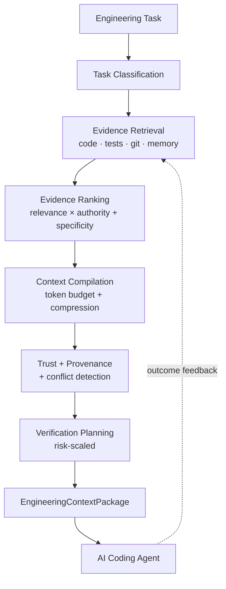

# Building an Engineering Context Compiler

The [previous post](01-context-not-more-context.md) argued that AI coding agents need a
judgment layer above retrieval — something that ranks evidence by trust, not just similarity,
and is honest about what it excluded. This post is about how that layer is actually built in
the [Engineering Context Compiler](../../README.md) (ECC): a deterministic pipeline, no model
call anywhere in it, developed as sixteen small, individually-verified phases rather than one
large system.

## The pipeline

Each stage is a separate, independently testable module, and each one only does the job its
name says:

1. **Task classification** turns a free-text request into one of nine `TaskType` values
   (`explain`, `debug`, `modify`, `review`, `refactor`, `investigate`, `plan`, `test`,
   `optimize`) using weighted keyword/phrase regex — not a model call. It doesn't need to be
   perfect; it needs to be fast, deterministic, and inspectable, and it feeds a `confidence`
   score downstream so later stages can tell when a classification is shaky.
2. **Evidence retrieval** pulls candidates from four sources — source code (with resolved
   top-level symbols), related tests, git history, and a persistent per-repository memory of
   past decisions/incidents/outcomes — each with a first-pass relevance score.
3. **Evidence ranking** combines that relevance with a static per-source-type authority
   weight and a specificity bonus for symbol-level matches, because a 0.6 relevance code match
   and a 0.6 relevance git commit aren't the same strength of evidence.
4. **Context compilation** greedily fills a token budget in rank order, truncating what it can
   (symbol lists capped at 8) and recording *why* anything was left out — `excluded: [{reason,
   count}]` — rather than silently dropping it.
5. **Trust + provenance** assigns every surviving item a `fact` / `derived` / `inference` /
   `unknown` trust level from a static rule table, reconstructs `provenance` for any item that
   doesn't already carry it, and detects structural conflicts (same subject, differing trust
   level) without ever silently resolving them.
6. **Verification planning** scores task risk from signals every earlier stage already
   computed — task type, missing test coverage, low-trust primary evidence, surfaced
   conflicts, blast radius — and emits a risk-scaled list of concrete next steps.
7. **Outcome feedback** (the newest stage) lets a recorded `outcome` entry's `positive` or
   `negative` signal nudge that path's future relevance and rank score, capped at ±2
   accumulated per path.

The output of all of this is a single schema-validated `EngineeringContextPackage` — the same
shape whether it's produced by the CLI, the MCP tool, the VS Code command, or the GitHub PR
integration, because all four call the same `runContext()` orchestrator. No surface
reimplements retrieval, ranking, or compilation.

## Why deterministic, rule-based tables instead of a model

Every scoring step in this pipeline — task classification, source authority weighting, trust
classification, risk assessment — is a hand-picked table or weighted-regex function, not a
trained model. This shows up repeatedly in
[`project-memory-bank/04-decisions.md`](../../project-memory-bank/04-decisions.md) (Decisions
#8, #11, #13, #21) with a consistent reasoning: a learned weighting needs training data, and
no meaningful outcome-volume data existed at any of those phases to train on. A model call also
adds latency, cost, and non-determinism to something that has to run on every single
compilation. The trade-off is real and stated plainly in those same decisions: a static table
can be wrong in ways a learned model might eventually correct, and it doesn't adapt on its
own. It's also trivially inspectable — every score is a sum of named factors, not a black box
— which matters for a tool whose entire purpose is telling an agent what to trust.

Phase 16 (Engineering Intelligence) is the one place this starts to change, and even there
it's a deterministic accumulator, not a trained model — see [post
five](05-from-context-engineering-to-engineering-intelligence.md) for why, and what a learned
version would actually require.

## Building in verified, small increments

The sixteen phases weren't a plan drafted up front and executed blind — each one has its own
exit criteria, its own decision record, and its own test suite before the next one starts. That
discipline is why [`implementation-status.md`](../../project-memory-bank/implementation-status.md)
can state, accurately, what's built and what isn't (no learned ranking, no semantic/embedding
retrieval, TypeScript/JavaScript repositories only, memory keyed on exact path strings) instead
of a document that oversells scope. 191 tests currently cover this pipeline
(`npm test`), spanning unit tests for pure functions, fixture-repo integration tests, and
isolated temp-repo tests for anything touching git or the memory store.

## What this buys an agent, concretely

[Golden Example 2](../examples/golden-example-02-refactoring/) is a useful case precisely
because it *isn't* a clean win on every metric: a naive keyword search finds the same two
files ECC does, at comparable token cost. What it doesn't produce is a `trustLevel` on either
file, a `provenance` pointer, the git commit message that already explains *why* the
duplication exists, the recorded decision confirming it was a deliberate trade-off, or a
verification plan that — correctly, because there's no test coverage — flags the change as
high risk and recommends adding tests before a peer review. That's the layer this pipeline
adds: not always more files, but consistently more judgment about the files it returns.

Next in the series: [why RAG alone doesn't get you this
layer](03-why-rag-alone-is-not-enough-for-software-engineering.md), even with a much better
retriever than the keyword-overlap one described here.
